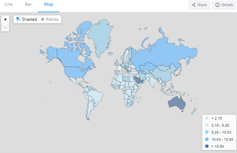
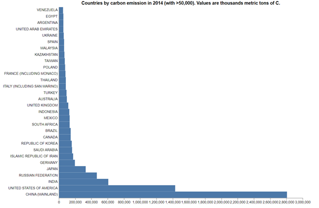
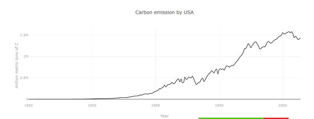
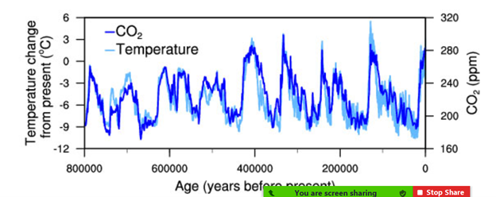
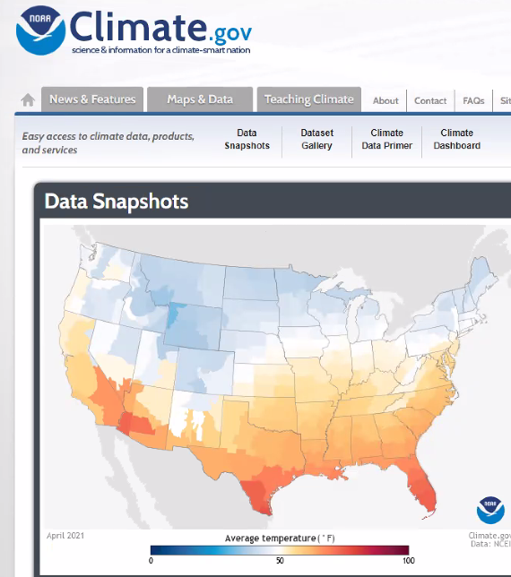

# Project Proposal
## Topic
A brief articulation of your chosen topic and rationale 
Emissions data by country/regions and impact on climate change. 

## Data Sources 

1. https://datahub.io/core/co2-fossil-by-nation
2. https://data.worldbank.org/indicator/EN.ATM.CO2E.PC?view=map&year=2016
3. https://gml.noaa.gov/ccgg/trends/gl_data.html
4. https://ourworldindata.org/co2-and-other-greenhouse-gas-emissions
5. https://raw.githubusercontent.com/owid/co2-data/master/owid-co2-data.csv
6. https://www.ncdc.noaa.gov/global-warming/temperature-change

## Example Graphs
 

Understand Emissions data across the globe by country/regions to understand impact on climate change. 
Sketching your ideal visuals:
a. Plotting markers on map w/ additional details (attributes)
b. Create a bar chart for top 10 countries
c. Plotting top 10 countries on a map and show progress comparing 2018 vs. 2020 data..
- cleanup data to remove outliers (lockdown periods etc.)

 

## Sketch
* Parallax design 
* Leaflet use 2 layers to paint the picture of CO2 (first layer) and temperature (second layer)….average temp increase (potential) from x year to y year…  
	Perhaps take a few cities in the world and not the entire world

## Technology 
* Panda DF
* D3
* Leaflet 
* Plotly
* Python Flask
* Database (PostgreSQL, MongoDB, SQLlite, etc.)

